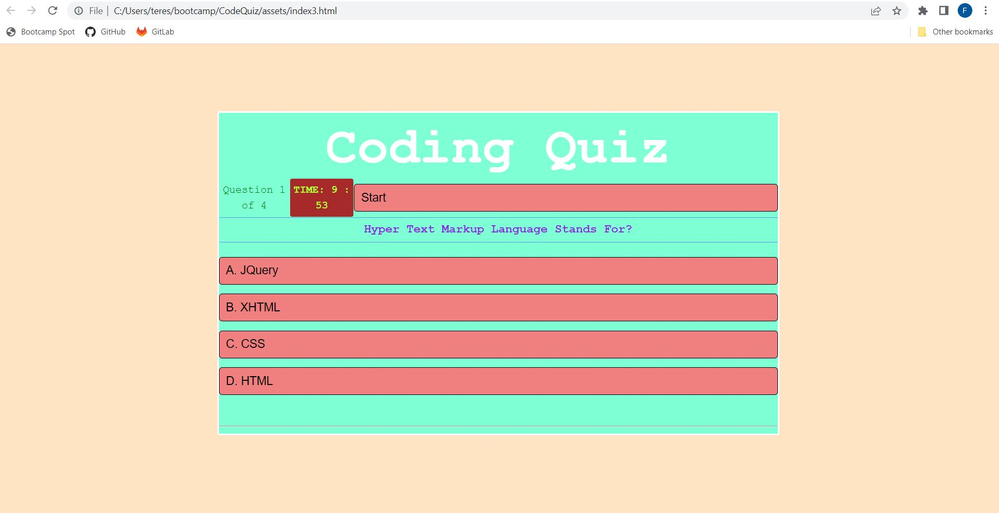

# CodeQuiz

##Description

This is a 10 minute timed Coding Quiz Application. If users enters an incorrect answer, time is subtracted from the clock. After the quiz has been completed, users will input their initials and their score will be stored in local storage. Users will have the ability to view their previous scores at the end of the quiz as well. 

The technologies I used are HTML, Javascript, and CSS. I used two HTML and Javascript files for the Quiz Questions and the High Scores page. CSS was used for styling my application. 

The challenges I faced were subtracting time from the clock when a user enters an incorrect answer and viewing the previous scores. I originally had one HTML file and one Javascript file, but decided to have separate HTML and Javascript files for the high scores functionality. Features I hope to implement in the future is enhancing the styling of the application. 

https://fdirige.github.io/CodeQuiz/

## Screen shot

 